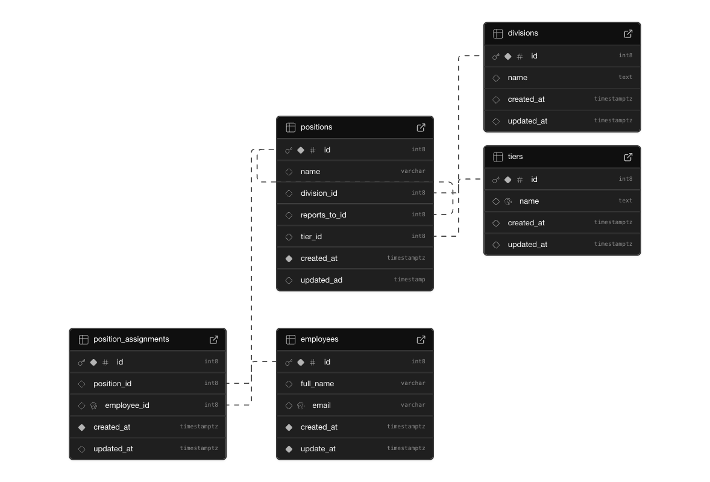
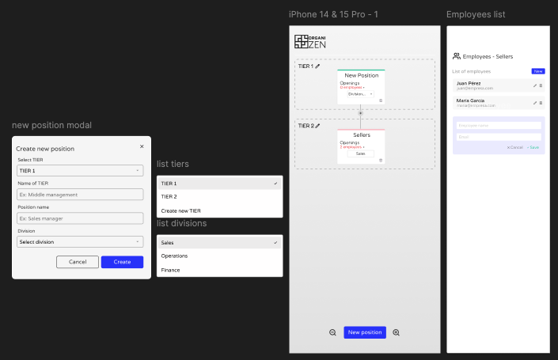

# Organizen App


Organizen es una aplicación web minimalista que permite a los usuarios crear, editar y gestionar organigramas de manera intuitiva. Con funcionalidad de arrastrar y soltar, organización basada en niveles y almacenamiento persistente, optimiza la visualización y estructura de cualquier empresa.

## Tabla de Contenidos

- [Descripción](#descripción)
- [Características](#características)
- [Construcción](#construcción)
- [Primeros Pasos](#primeros-pasos)
- [Despliegue en Vercel](#despliegue-en-vercel)
- [Modelo de Base de Datos](#modelo-de-base-de-datos)
- [Prototipo en Figma](#prototipo-en-figma)
- [Contribuciones](#contribuciones)
- [Licencia](#licencia)
- [Autor](#autor)


## Características

- Creación y edición de organigramas
- Funcionalidad de arrastrar y soltar
- Gestión de empleados y posiciones
- Almacenamiento persistente
- Temas claro y oscuro

## Construccion
Organizen está construido con las siguientes tecnologías:

- Frontend: React, TypeScript, Tailwind CSS
- Backend: Supabase (como BaaS)
- Gestión del Estado: Zustand
- Pruebas: Jest, React Testing Library

## Primeros Pasos

Este es un proyecto [Next.js](https://nextjs.org) creado con [`create-next-app`](https://nextjs.org/docs/app/api-reference/cli/create-next-app).

### Instalación

Sigue estos pasos para correr la aplicación en tu entorno local:

1. Clona el repositorio:
   ```bash
   git clone https://github.com/untalinfo/organizen.git
   cd organizen
   ```
2. Instala las dependencias:
   ```bash
   yarn install
   ```
3. Configura las variables de entorno: Crea un archivo .env en la raíz del proyecto y añade las siguientes variables:
   ```bash
   REACT_APP_SUPABASE_URL=tu_supabase_url
   REACT_APP_SUPABASE_ANON_KEY=tu_supabase_anon_key
   ```
4. Corre la aplicación:
   ```bash
   yarn dev
   ```

Abre http://localhost:3000 en tu navegador para ver el resultado.

Puedes comenzar a editar la página modificando page.tsx. La página se actualiza automáticamente a medida que editas el archivo.

Este proyecto utiliza next/font para optimizar y cargar automáticamente Geist, una nueva familia de fuentes para Vercel.

## Despliegue de aplicacion en Vercel

La aplicacion se encuentra desplegada en vercel, para acceder mas rapido y en linea puedes hacerlo desde el siguiente en link:

[oranizen.vercel.app](https://oranizen.vercel.app/)

La forma más fácil de desplegar tu aplicación Next.js es usar la [Plataforma Vercel](https://nextjs.org/docs/app/building-your-application/optimizing/fonts) de los creadores de Next.js.

Consulta nuestra [documentación de despliegue de Next.js](https://nextjs.org/docs/app/building-your-application/deploying) para más detalles.

## Modelo de base de datos
El modelo de base de datos de Organizen está diseñado para soportar la gestión de organigramas y empleados. La base de datos está alojada en Supabase. Aquí tienes una representación del modelo:



## Prototipo en Figma
Puedes ver el prototipo inicial de la aplicación en Figma haciendo clic a continuación:

[Prototipo](https://hoost.ru/ds/free/53474f9a/live/?iphone-14-15-pro-1)

[Prototipo en Figma](https://www.figma.com/proto/0u8Y1IWCmSeOcaLjY1z7xr/Untitled?node-id=152-13&p=f&t=QDFtEZozjpZpA9Xh-1&scaling=scale-down&content-scaling=fixed&page-id=149%3A4&starting-point-node-id=152%3A13) requiere solicitar acceso



## Contribuciones
Las contribuciones son bienvenidas. Por favor, sigue los siguientes pasos para contribuir:

1. Haz un fork del repositorio.
2. Crea una nueva rama (git checkout -b feature/nueva-funcionalidad).
3. Realiza tus cambios y haz commit (git commit -am 'Añadir nueva funcionalidad').
4. Haz push a la rama (git push origin feature/nueva-funcionalidad).
5. Abre un Pull Request.

## Licencia
Este proyecto está licenciado bajo la Licencia MIT.

## Autor
Proyecto desarrollado por:

[Untalinfo - GitHub](https://github.com/untalinfo)

[LinkedIn](https://www.linkedin.com/in/untalinfo/)

[email: racso1607@gmail.com](racso1607@gmail.com)